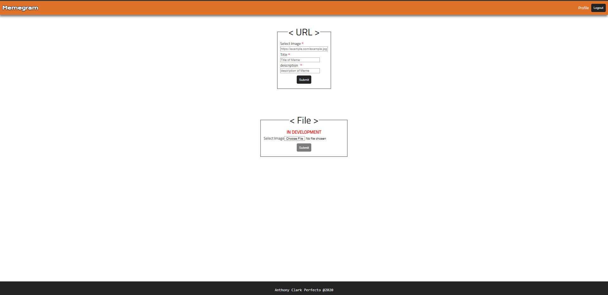

# Memegram - Client

## LIVE APP

- https://memegram.now.sh/

## Summary

- An Image(Memes) browsing app where you can browse memes to your hearts content and be filled with giggles! Or be a contributor and create an account and upload memes yourself whether it be something you found online or something wipped up yourself, you can then give it some funny title or witty description to add to its "memeness". Do you find a particular meme extremely funny? is it boring or weak? Leave a comment and let the poster know!

## Tech Stack

- Reactjs
- React Router
- React Context
- JavaScript ES6
- JSX/HTML 5
- CSS3
- Enzyme/Jest
- Zeit

## Screenshots

### Landin Page

- Desktop
  

- Mobile
  

### Image Page

- Desktop
  

- Mobile
  

### Profile Page

- Desktop
  

- Mobile
  

### Login Page

- Desktop
  

- Mobile
  

### Register Page

- Desktop
  

- Mobile
  

### Upload Page

- Desktop
  

- Mobile
  

## In Development

- Allow users to upload image files
- Allow users to delete comments they created
- Upvote/Downvote feature
- Favorites Features
- Search Bar
- Categories/Tags
- Allow users to delete their own accounts
- Admin User
- Settings
